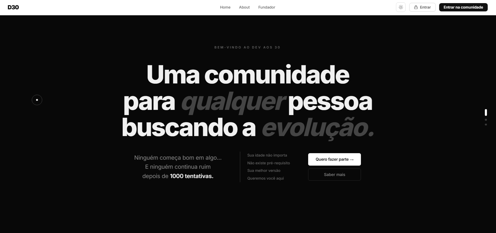

# D30 — Dev aos 30

> Comunidade gratuita em português para quem está em transição de carreira para dev — em qualquer idade.



---

## O que é

A D30 é uma comunidade real, sem fórmula mágica, feita por quem tá no mesmo caminho. Fórum ativo, palestras mensais, roadmap de estudos com foco em Java, sala de estudos no Discord e vagas filtradas para jr e transição de carreira.

## Stack

- HTML + CSS + JavaScript puro
- React 18 (UMD, sem build step)
- Babel Standalone (JSX no browser)
- Lenis smooth scroll

## Como rodar

Abre `html/website/index.html` direto no browser. Sem instalação, sem npm.

## Estrutura

```
css/
  d30.css       — tokens, componentes base (dark)
  kit.css       — light theme + overrides do site
js/
  App.jsx       — roteamento
  HomePage.jsx  — hero + pastas + seção fundador
  Nav.jsx       — navegação fixa
  motion.js     — fullpage scroll + animações
  ...
html/
  website/
    index.html  — entry point
images/
  augusto.png
```

---

Feito por [@Dev.aos30](https://www.instagram.com/dev.aos30/) · D30 é de todo mundo
